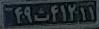
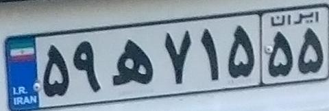
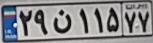
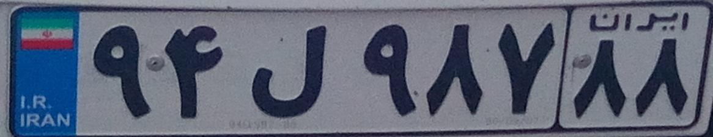
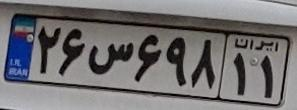
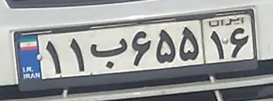
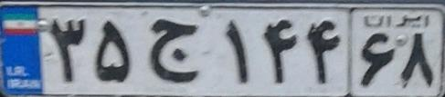
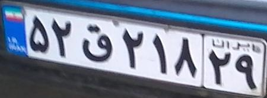
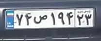
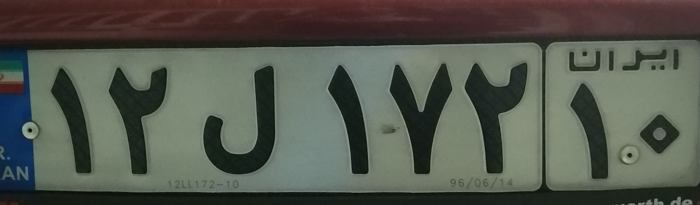

# Persian License Plate Recognition using Deep Text Recognition Benchmark

# Description 
Here we are going to use [IR-LPR](https://github.com/mut-deep/IR-LPR) persian license plate dataset , to train our model . <br/>
For this , we are going to use [deep-text-recognition-benchmark](https://github.com/clovaai/deep-text-recognition-benchmark/tree/master) repository to recognize persian license plate numbers . 

+ 1_ first we have to clone [deep-text-recognition-benchmark](https://github.com/clovaai/deep-text-recognition-benchmark/tree/master) .
+ 2_ for downloading `TPS-ResNet-BiLSTM-Attn.pth` file from google drive, we have used  `gdown`.
+ 3_ then we should install `lmdb` .
+ 4_ now , we are able to train  `deep-text-recognition-benchmark` , on OUR OWN Non-Latin language dataset . <br/>
Therefore, we use Transfer learning , and `Fine Tune` RESNET on our own dataset . 
+ 5_ We need to create dataset with `lmdb` Format . 
<br/>
image address  -------  it's text <br/>
train/plate_1.png ----  18W75433 <br/>
train/plate_2.png ----  52H96711 <br/>
train/plate_3.png ----  23M75142 <br/>

### **HERE, LABELS ARE LICENSE PLATE CHARACTERS**.


+ 7_ we should create txt file which contains address of images and their text . it means that , we should give this txt file and  image folder to `create_lmdb_dataset.py` , then this will create lmdb's files . 
+ 8_ now , we should give lmdb's files to `train.py` to start train phase . 

+ 9_ results are going to be saved in dataset folder .
now mdb files are created . and are going too used in train stage .

# How to install 
```
pip install -r requirements.txt
```
# How to run 
before runnig DTRB.ipynb file , you should run xml_reader.py to to create gt_train.txt and gt_validation.txt files .

# RESULTS 

  | Best_accuracy | Validation_loss |
  | :---: | :---: |
  | 80.793 |  0.47 |

  
<br/>

 + trained weights :

https://drive.google.com/file/d/1ZnwBmmYhQARGxp-xAk6jdoqLiD7mxIf9/view?usp=drive_link


<br/>

|                Ground Truth                 | predicted_labels |
|:-------------------------------------:| :-------------------------------------:| 
|  | 12a38211 |
|  | 12e79911 |
|  | 57t55 |
|  | 37t94263 |
|  | 59h71555 |
|  | 29n11577 | 
|  | 94l98788 | 
|  | 26c69811 | 
|  | 11b65516 | 
|  | 35j14468 | 
|  | 49m89812 | 
|  | 52q21829 | 
|  | 74u19423 | 
|  | my license plate : 12l17210 | 
