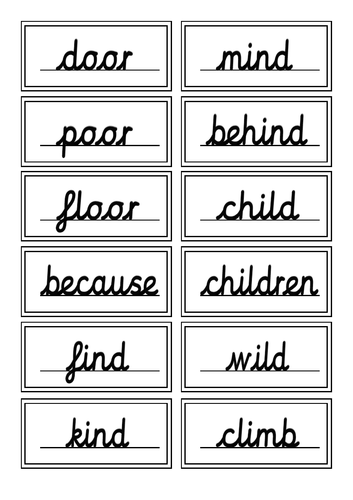
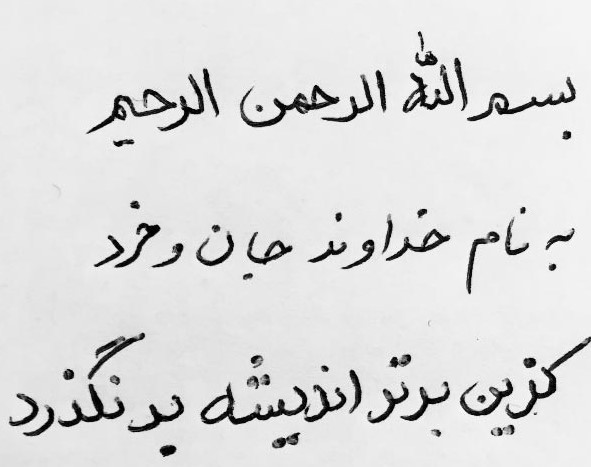
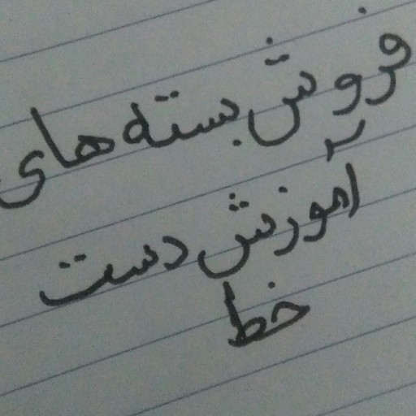
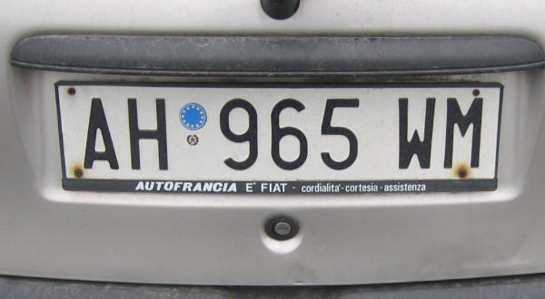
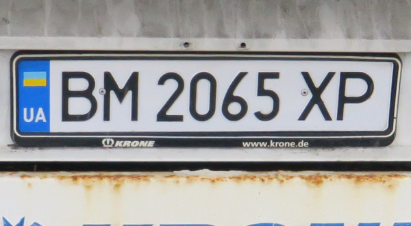
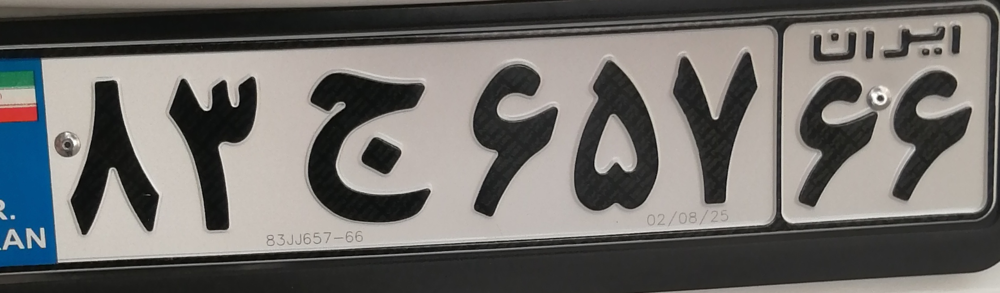
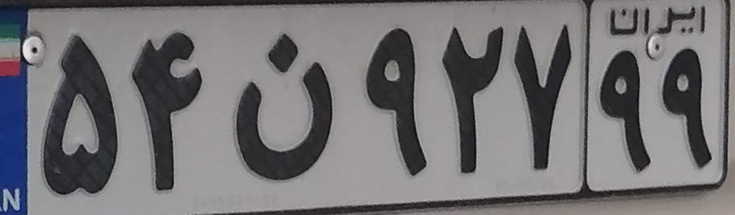
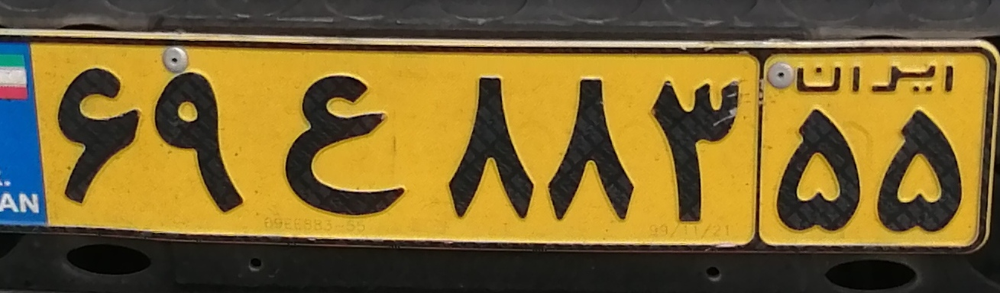
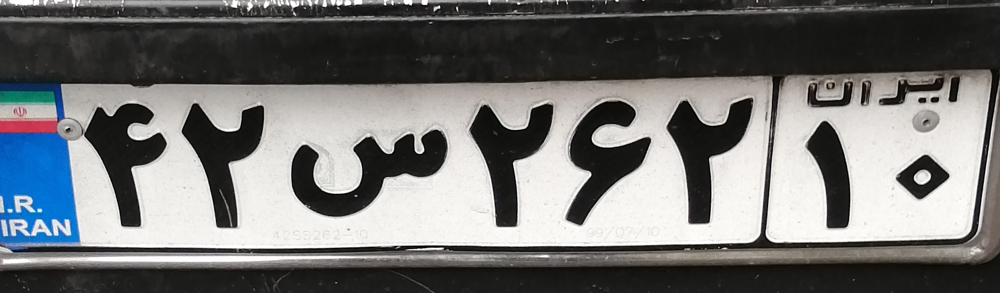

# EasyOCR (Optical character recognition)

detection + recognition 

# Description 
input_image ---> DETECTOR ---> predict bounding boxes ---> RECOGNIZER ---> recognized words 

in last project we used YOLO to detect the license plates .
AND now , we are going to recognize those license plate character .

**OCR** means recognize a text which has been detected before . 

# How to install 
Run this command to install used libraries :

pip install -r requirements.txt 

# How to run 

you just need to run `EasyOCR.ipynb` file .

# RESULTS

## 1-   Inference on a latin hand-writing text image

image :

     

result : 
['door', 'mind', 'pOOr', 'behind', 'Yloor_', 'child', 'becaWse', 'children', 'Yind', 'wild', 'kind', 'clinb']

# _____________________________________________________________________

## 2- Inference on a persian hand-writing text image
image :

     

result :  
['سمالند الرحمن', '~ نام حداور حان رحرد', 'کزبن برترا نذدشد درنلدرد', 'الرحم']

### _____________________________________________________________________
image :

     

result :  
['های', 'هروسٰ بسته', 'اهورش دست', 'خط']

### ____________________________________________________________________

# Inference on a latin license plate image
image :

     

result :  
['AH', '965 WM', 'AUTOFRANCI', 'E FIAT', 'cordialita -cortesia - assistenza']

### _____________________________________________________________________
image :

     

result : 
['UA', 'BM 2065 XP', 'QERONE', 'WWW krone de']

# ______________________________________________
# Inference on a persian license plate image

image :

     

result : 
['ایل ان', '٦٦ ٦٥٧ج', '`', '02/08/25_', '٥٥', '8300657-66', '٨٣']

### ___________________________________________________________

image :

     

result : 
['٥٤٥٩٢٧٩٩', '٨']

### ___________________________________________________________

image :

     

result : 
['اببدان', '٥٨', '٥٥ ٤٨٨٣ ٦٩']

### ___________________________________________________________

image :

     

result : 
['ایید اث', '1./.', '١٠ ٢٦٢س٤٢', '٥', '4258262`10', '9/07/10']

### ___________________________________________________________

